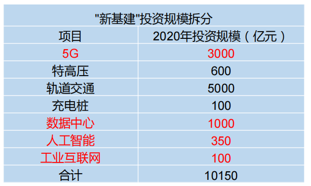

# 大数据概论

## 一、大数据概念
大数据（Big Data）：指无法在一定时间范围内用常规软件工具进行捕捉、管理和处理的数据集合，是需要新处理模式才能具有更强的决策力、洞察发现力和流程优化能力的海量、高增长率和多样化的信息资产。

大数据主要解决，海量数据的采集、存储和分析计算问题。

按顺序给出数据存储单位：bit、Byte、KB、MB、GB、TB、PB、EB、ZB、YB、BB、NB、DB。

1Byte = 8bit   
1K = 1024Byte   
1MB = 1024K   
1G = 1024M   
1T = 024G   
1P = 1024T   

## 二、大数据特点（4V）
### 1、Volume（大量）
截至目前，人类生产的所有印刷材料的数据量是200PB，而历史上全人类总共说过的话的数据量大约是5EB。当前，典型个人计算机硬盘的容量为TB量级，而一些大企业的数据量已经接近EB量级。
### 2、Velocity（高速）
这是大数据区分于传统数据挖掘的最显著特征。根据IDC的“数字宇宙”的报告，预计到2025年，全球数据使用量将达到163ZB。在如此海量的数据面前，处理数据的效率就是企业的生命。
### 3、Variety（多样）
这种类型的多样性也让数据被分为结构化数据和非结构化数据。相对于以往便于存储的以数据库/文本为主的结构化数据，非结构化数据越来越多，包括网络日志、音频、视频、图片、地理位置信息等，这些多类型的数据对数据的处理能力提出了更高要求。
### 4、Value（低价值密度）
价值密度的高低与数据总量的大小成反比。

## 三、大数据应用场景
1、抖音：推荐的都是你喜欢的视频   
2、电商站内广告推荐：给用户推荐可能喜欢的商品   
3、零售：分析用户消费习惯，为用户购买商品提供方便，从而提升商品销量。（经典案例，纸尿布+啤酒。）   
4、物流仓储：京东物流，上午下单下午送达、下午下单次日上午送达   
5、保险：海量数据挖掘及风险预测，助力保险行业精准营销，提升精细化定价能力。    
6、金融：多维度体现用户特征，帮助金融机构推荐优质客户，防范欺诈风险。   
7、房产：大数据全面助力房地产行业，打造精准投策与营销，选出更合适的地，建造更合适的楼，卖给更合适的人。   
8、人工智能 + 5G + 物联网 + 虚拟与现实   

## 四、大数据发展前景
1、党的十九大提出“推动互联网、大数据、人工智能和实体经济深度融合”。   
2、2020年初，中央推出34万亿“新基建”投资计划

3、下一个风口   
自古不变的真理：先入行者吃肉，后入行者喝汤，最后到的买单！   
2020年是5G的元年，国家在大力铺设5G设备，2021年就是5G手机应用的开始，也是大数据要爆发的1年。5G带来的是每秒钟10G的数据，会给每家公司都带来海量的数据。那么传统的Java工具根本解决不了海量数据的存储。就更不用说海量数据的计算了   
3G时只能打电话、发短信，当时还觉得很好，觉得3G不错。但是4G来了后，大家很少打电话和发短信了，都改为语音、视频、直播、网上购物等生活方式，带火了淘宝、京东、美团、字节跳动等企业。没有跟上节奏的百度，有点摇摇欲坠。   
4、人才紧缺、竞争压力小   
有句话叫：“选择大于努力”选择一个好的方向，少奋斗十年。国家在2017年开设大数据课程，当时北京大学、人民大学等25所高校开设第一批大数据课程。
