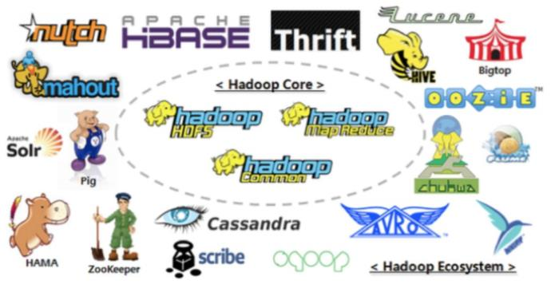
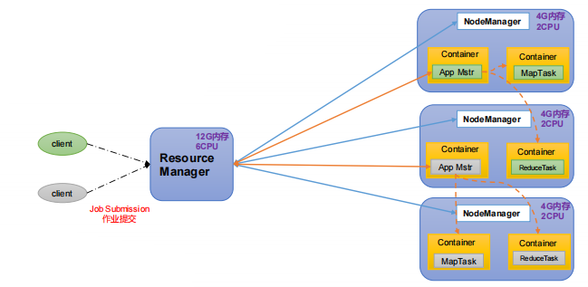
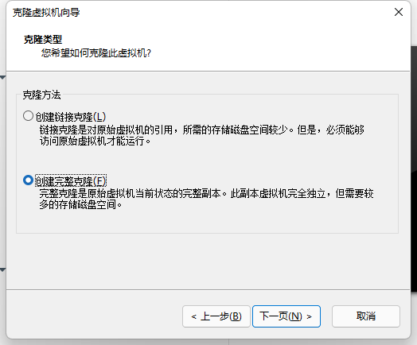

# Hadoop 入门
## 一、Hadoop是什么
### 1.1 Hadoop是什么
1）Hadoop是一个由Apache基金会所开发的分布式系统基础架构。   
2）主要解决，海量数据的存储和海量数据的分析计算问题。   
3）广义上来说，Hadoop通常是指一个更广泛的概念——Hadoop生态圈。   

### 1.2 Hadoop发展历史（了解）
1）Hadoop创始人Doug Cutting，为 了实 现与Google类似的全文搜索功能，他在Lucene框架基础上进行优化升级，查询引擎和索引引擎。   
   
2）2001年年底Lucene成为Apache基金会的一个子项目。   
3）对于海量数据的场景，Lucene框架面对与Google同样的困难，存储海量数据困难，检索海量速度慢。   
4）学习和模仿Google解决这些问题的办法 ：微型版Nutch。   
5）可以说Google是Hadoop的思想之源（Google在大数据方面的三篇论文）   
GFS --->HDFS   
Map-Reduce --->MR   
BigTable --->HBase   
6）2003-2004年，Google公开了部分GFS和MapReduce思想的细节，以此为基础Doug Cutting等人用 了2年业余时间实现了DFS和MapReduce机制，使Nutch性能飙升。   
7）2005年Hadoop作为Lucene的子项目Nutch的一部分正式引入Apache基金会。   
8）2006年3月份，Map-Reduce和Nutch Distributed File System （NDFS）分别被纳入到 Hadoop 项目中，Hadoop就此正式诞生，标志着大数据时代来临。   
9）名字来源于Doug Cutting儿子的玩具大象   

### 1.3 Hadoop三大发行版本（了解）
Hadoop 三大发行版本：Apache、Cloudera、Hortonworks。   
Apache 版本最原始（最基础）的版本，对于入门学习最好。（2006年）   
Cloudera 内部集成了很多大数据框架，对应产品 CDH。（2008年）   
Hortonworks 文档较好，对应产品 HDP。（2011年）   
Hortonworks 现在已经被 Cloudera 公司收购，推出新的品牌 CDP。
#### 1）Apache Hadoop
官网地址：[http://hadoop.apache.org](http://hadoop.apache.org)   
下载地址：[https://hadoop.apache.org/releases.html](https://hadoop.apache.org/releases.html)
#### 2）Cloudera Hadoop
官网地址：[https://www.cloudera.com/downloads/cdh](https://www.cloudera.com/downloads/cdh)   
下载地址：[https://docs.cloudera.com/documentation/enterprise/6/releasenotes/topics/rg_cdh_6_download.html](https://docs.cloudera.com/documentation/enterprise/6/releasenotes/topics/rg_cdh_6_download.html)   
（1）2008 年成立的 Cloudera 是最早将 Hadoop 商用的公司，为合作伙伴提供 Hadoop 的商用解决方案，主要是包括支持、咨询服务、培训。   
（2）2009 年 Hadoop 的创始人 Doug Cutting 也加盟 Cloudera 公司。Cloudera 产品主要为 CDH，Cloudera Manager，Cloudera Support   
（3）CDH 是 Cloudera 的 Hadoop 发行版，完全开源，比 Apache Hadoop 在兼容性，安全性，稳定性上有所增强。Cloudera 的标价为每年每个节点 10000 美元。   
（4）Cloudera Manager 是集群的软件分发及管理监控平台，可以在几个小时内部署好一个 Hadoop 集群，并对集群的节点及服务进行实时监控。
#### 3）Hortonworks Hadoop
官网地址：[https://hortonworks.com/products/data-center/hdp/](https://hortonworks.com/products/data-center/hdp/)   
下载地址：[https://hortonworks.com/downloads/#data-platform](https://hortonworks.com/downloads/#data-platform)   
（1）2011 年成立的 Hortonworks 是雅虎与硅谷风投公司 Benchmark Capital 合资组建。   
（2）公司成立之初就吸纳了大约 25 名至 30 名专门研究 Hadoop 的雅虎工程师，上述工程师均在 2005 年开始协助雅虎开发 Hadoop，贡献了 Hadoop80%的代码。   
（3）Hortonworks 的主打产品是 Hortonworks Data Platform（HDP），也同样是 100%开源的产品，HDP 除常见的项目外还包括了 Ambari，一款开源的安装和管理系统。   
（4）2018 年 Hortonworks 目前已经被 Cloudera 公司收购。
### 1.4 Hadoop 优势（4 高）
1）高可靠性：Hadoop底层维护多个数据副本，所以即使Hadoop某个计算元
素或存储出现故障，也不会导致数据的丢失。   
2）高扩展性：在集群间分配任务数据，可方便的扩展数以千计的节点。   
3）高效性：在MapReduce的思想下，Hadoop是并行工作的，以加快任务处
理速度。   
4）高容错性：能够自动将失败的任务重新分配。
### 1.5 Hadoop组成（面试重点）
在 Hadoop1.x 时代，Hadoop中的MapReduce同时处理业务逻辑运算和资源的调度，耦合性较大。   
在Hadoop2.x时代，增加 Yarn。Yarn只负责资源的调度，MapReduce只负责运算。   
Hadoop3.x在组成上没有变化。   

#### 1.5.1 HDFS架构概述
Hadoop Distributed File System，简称 HDFS，是一个分布式文件系统。   
1）NameNode（nn）：存储文件的元数据，如文件名，文件目录结构，文件属性（生成时间、副本数、文件权限），以及每个文件的块列表和块所在的DataNode等。   
2）DataNode(dn)：在本地文件系统存储文件块数据，以及块数据的校验和。   
3）Secondary NameNode(2nn)：每隔一段时间对NameNode元数据备份。
#### 1.5.2 YARN架构概述
Yet Another Resource Negotiator 简称 YARN ，另一种资源协调者，是 Hadoop 的资源管理器。
1）ResourceManager（RM）：整个集群资源（内存、CPU等）的老大   
3）ApplicationMaster（AM）：单个任务运行的老大   
2）NodeManager（N M）：单个节点服务器资源老大   
4）Container：容器，相当一台独立的服务器，里面封装了任务运行所需要的资源，如内存、CPU、磁盘、网络等。   
   
说明1：客户端可以有多个   
说明2：集群上可以运行多个ApplicationMaster   
说明3：每个NodeManager上可以有多个Container
#### 1.5.3 MapReduce 架构概述
MapReduce 将计算过程分为两个阶段：Map 和 Reduce   
1）Map 阶段并行处理输入数据   
2）Reduce 阶段对 Map 结果进行汇总

#### 1.5.4 HDFS、YARN、MapReduce三者关系

### 1.6 大数据技术生态体系
   
图中涉及的技术名词解释如下：
1）Sqoop：Sqoop 是一款开源的工具，主要用于在 Hadoop、Hive 与传统的数据库（MySQL）间进行数据的传递，可以将一个关系型数据库（例如 ：MySQL，Oracle 等）中的数据导进到 Hadoop 的 HDFS 中，也可以将 HDFS 的数据导进到关系型数据库中。   
2）Flume：Flume 是一个高可用的，高可靠的，分布式的海量日志采集、聚合和传输的系统，Flume 支持在日志系统中定制各类数据发送方，用于收集数据；   
3）Kafka：Kafka 是一种高吞吐量的分布式发布订阅消息系统；   
4）Spark：Spark 是当前最流行的开源大数据内存计算框架。可以基于 Hadoop 上存储的大数据进行计算。   
5）Flink：Flink 是当前最流行的开源大数据内存计算框架。用于实时计算的场景较多。   
6）Oozie：Oozie 是一个管理 Hadoop 作业（job）的工作流程调度管理系统。   
7）Hbase：HBase 是一个分布式的、面向列的开源数据库。HBase 不同于一般的关系数据库，它是一个适合于非结构化数据存储的数据库。   
8）Hive：Hive 是基于 Hadoop 的一个数据仓库工具，可以将结构化的数据文件映射为一张数据库表，并提供简单的 SQL 查询功能，可以将 SQL 语句转换为 MapReduce 任务进行运行。其优点是学习成本低，可以通过类 SQL 语句快速实现简单的 MapReduce 统计，不必开发专门的 MapReduce 应用，十分适合数据仓库的统计分析。   
9）ZooKeeper：它是一个针对大型分布式系统的可靠协调系统，提供的功能包括：配置维护、名字服务、分布式同步、组服务等。
### 1.7 推荐系统框架图

## 二、Hadoop 运行环境搭建（开发重点）
### 2.1 模板虚拟机环境准备

#### 1）hadoop100 虚拟机配置要求（本文 Linux 系统全部以 CentOS-7.5-x86-1804 为例）
（1）使用 yum 安装需要虚拟机可以正常上网，yum 安装前可以先测试下虚拟机联网情况
```shell
[root@hadoop100 ~]# ping www.baidu.com
PING www.baidu.com (14.215.177.39) 56(84) bytes of data.
64 bytes from 14.215.177.39 (14.215.177.39): icmp_seq=1
ttl=128 time=8.60 ms
64 bytes from 14.215.177.39 (14.215.177.39): icmp_seq=2
ttl=128 time=7.72 ms
```
（2）安装 epel-release   
注：Extra Packages for Enterprise Linux 是为“红帽系”的操作系统提供额外的软件包，适用于 RHEL、CentOS 和 Scientific Linux。相当于是一个软件仓库，大多数 rpm 包在官方repository 中是找不到的）
```shell
[root@hadoop100 ~]# yum install -y epel-release
```
（3）注意：如果 Linux 安装的是最小系统版，还需要安装如下工具；如果安装的是 Linux桌面标准版，不需要执行如下操作   
➢ net-tool：工具包集合，包含 ifconfig 等命令
```shell
[root@hadoop100 ~]# yum install -y net-tools
```
➢ vim：编辑器   
```shell
[root@hadoop100 ~]# yum install -y vim
```
#### 2）关闭防火墙，关闭防火墙开机自启
```shell
[root@hadoop100 ~]# systemctl stop firewalld
[root@hadoop100 ~]# systemctl disable firewalld.service
```
注意：在企业开发时，通常单个服务器的防火墙时关闭的。公司整体对外会设置非常安全的防火墙   
#### 3）创建 atguigu 用户，并修改 atguigu 用户的密码
```shell
[root@hadoop100 ~]# useradd atguigu
[root@hadoop100 ~]# passwd atguigu
```
#### 4）配置 atguigu 用户具有 root 权限，方便后期加 sudo 执行 root 权限的命令
```shell
[root@hadoop100 ~]# vim /etc/sudoers
```
修改/etc/sudoers 文件，在%wheel 这行下面添加一行，如下所示：
```shell
## Allow root to run any commands anywhere

root ALL=(ALL) ALL

## Allows people in group wheel to run all commands

%wheel ALL=(ALL) ALL
atguigu ALL=(ALL) NOPASSWD:ALL
```
注意：atguigu 这一行不要直接放到 root 行下面，因为所有用户都属于 wheel 组，你先配置了 atguigu 具有免密功能，但是程序执行到%wheel 行时，该功能又被覆盖回需要密码。所以 atguigu 要放到%wheel 这行下面。   
#### 5）在/opt 目录下创建文件夹，并修改所属主和所属组
（1）在/opt 目录下创建 module、software 文件夹
```shell
[root@hadoop100 ~]# mkdir /opt/module
[root@hadoop100 ~]# mkdir /opt/software
```
（2）修改 module、software 文件夹的所有者和所属组均为 atguigu 用户
```shell
[root@hadoop100 ~]# chown atguigu:atguigu /opt/module
[root@hadoop100 ~]# chown atguigu:atguigu /opt/software
```
（3）查看 module、software 文件夹的所有者和所属组
```shell
[root@hadoop100 ~]# cd /opt/
[root@hadoop100 opt]# ll
总用量 12
drwxr-xr-x. 2 atguigu atguigu 4096 5 月 28 17:18 module
drwxr-xr-x. 2 root root 4096 9 月 7 2017 rh
drwxr-xr-x. 2 atguigu atguigu 4096 5 月 28 17:18 software
```
#### 6）卸载虚拟机自带的 JDK
注意：如果你的虚拟机是最小化安装不需要执行这一步。
```shell
[root@hadoop100 ~]# rpm -qa | grep -i java | xargs -n1 rpm -e
--nodeps
```
➢ rpm -qa：查询所安装的所有 rpm 软件包   
➢ grep -i：忽略大小写   
➢ xargs -n1：表示每次只传递一个参数   
➢ rpm -e –nodeps：强制卸载软件
#### 7）安装jdk
（1）卸载现有 JDK   
（2）将jdk上传到`/opt/software/`   
（3）解压 JDK 到`/opt/module` 目录下
```shell
[atguigu@hadoop102 software]$ tar -zxvf jdk-8u212-linux-x64.tar.gz -C /opt/module/
```
（4）配置环境变量   
新建/etc/profile.d/my_env.sh 文件并添加如下内容，保存后退出
```shell
[atguigu@hadoop102 ~]$ sudo vim /etc/profile.d/my_env.sh
#JAVA_HOME
export JAVA_HOME=/opt/module/jdk1.8.0_212
export PATH=$PATH:$JAVA_HOME/bin
```
source 一下/etc/profile 文件，让新的环境变量 PATH 生效
```shell
[atguigu@hadoop102 ~]$ source /etc/profile
```
测试jdk是否安装成功，如果不生效可以重启
#### 8）安装Hadoop
Hadoop 下载地址：[https://archive.apache.org/dist/hadoop/common/hadoop-3.1.3/](https://archive.apache.org/dist/hadoop/common/hadoop-3.1.3/)   
将Hadoop上传到`/opt/software/`，并解压到`/opt/module`
```shell
[atguigu@hadoop102 software]$ tar -zxvf hadoop-3.1.3.tar.gz -C /opt/module/
```
将Hadoop添加到环境变量，编辑`/etc/profile.d/my_env.sh`文件
```shell
[atguigu@hadoop102 hadoop-3.1.3]$ sudo vim /etc/profile.d/my_env.sh
#HADOOP_HOME
export HADOOP_HOME=/opt/module/hadoop-3.1.3
export PATH=$PATH:$HADOOP_HOME/bin
export PATH=$PATH:$HADOOP_HOME/sbin
[atguigu@hadoop102 hadoop-3.1.3]$ source /etc/profile
[atguigu@hadoop102 hadoop-3.1.3]$ hadoop version
Hadoop 3.1.3
```
如果不生效，可以重启尝试   
   
查看 Hadoop 目录结构
```shell
[atguigu@hadoop102 hadoop-3.1.3]$ ll
总用量 52
drwxr-xr-x. 2 atguigu atguigu 4096 5 月 22 2017 bin
drwxr-xr-x. 3 atguigu atguigu 4096 5 月 22 2017 etc
drwxr-xr-x. 2 atguigu atguigu 4096 5 月 22 2017 include
drwxr-xr-x. 3 atguigu atguigu 4096 5 月 22 2017 lib
drwxr-xr-x. 2 atguigu atguigu 4096 5 月 22 2017 libexec
-rw-r--r--. 1 atguigu atguigu 15429 5 月 22 2017 LICENSE.txt
-rw-r--r--. 1 atguigu atguigu 101 5 月 22 2017 NOTICE.txt
-rw-r--r--. 1 atguigu atguigu 1366 5 月 22 2017 README.txt
drwxr-xr-x. 2 atguigu atguigu 4096 5 月 22 2017 sbin
drwxr-xr-x. 4 atguigu atguigu 4096 5 月 22 2017 share
```
> （1）bin 目录：存放对 Hadoop 相关服务（hdfs，yarn，mapred）进行操作的脚本
> （2）etc 目录：Hadoop 的配置文件目录，存放 Hadoop 的配置文件
> （3）lib 目录：存放 Hadoop 的本地库（对数据进行压缩解压缩功能）
> （4）sbin 目录：存放启动或停止 Hadoop 相关服务的脚本
> （5）share 目录：存放 Hadoop 的依赖 jar 包、文档、和官方案例
#### 9）配置网络
（1）查看 Linux 虚拟机的虚拟网络编辑器，编辑->虚拟网络编辑器->VMnet8   
   
   
（2）查看 Windows 系统适配器 VMware Network Adapter VMnet8 的 IP 地址


（3）保证 Linux 系统 ifcfg-ens33 文件中 IP 地址、虚拟网络编辑器地址和 Windows 系统 VM8 网络 IP 地址相同。   
（4）修改模板虚拟机的静态 IP
```shell
[root@hadoop100 ~]# vim /etc/sysconfig/network-scripts/ifcfg-ens33
```
改成
```shell
DEVICE=ens33
TYPE=Ethernet
ONBOOT=yes
BOOTPROTO=static
NAME="ens33"
IPADDR=192.168.10.100
GATEWAY=192.168.10.2
DNS1=192.168.10.2
```
（5）修改主机名称
```shell
[root@hadoop100 ~]# vim /etc/hostname
hadoop100
```
（6）配置 Linux 克隆机主机名称映射 hosts 文件，打开/etc/hosts
添加如下内容
```shell
[root@hadoop100 ~]# vim /etc/hosts
192.168.10.100 hadoop100
192.168.10.101 hadoop101
192.168.10.102 hadoop102
192.168.10.103 hadoop103
192.168.10.104 hadoop104
192.168.10.105 hadoop105
192.168.10.106 hadoop106
192.168.10.107 hadoop107
192.168.10.108 hadoop108
```
（7）修改Windows hosts文件   
进入 `C:\Windows\System32\drivers\etc` 路径   
修改`hosts`文件
```
192.168.10.100 hadoop100
192.168.10.101 hadoop101
192.168.10.102 hadoop102
192.168.10.103 hadoop103
192.168.10.104 hadoop104
192.168.10.105 hadoop105
192.168.10.106 hadoop106
192.168.10.107 hadoop107
192.168.10.108 hadoop108
```
#### 10）重启虚拟机
```shell
[root@hadoop100 ~]# reboot
```
#### 11）关机克隆   
   

### 2.2 克隆虚拟机
#### 1）利用模板机 hadoop100，克隆三台虚拟机：hadoop102 hadoop103 hadoop104
注意：克隆时，要先关闭 hadoop100
#### 2）修改克隆机 IP，以下以 hadoop102 举例说明
（1）修改克隆虚拟机的静态 IP
```shell
[root@hadoop100 ~]# vim /etc/sysconfig/network-scripts/ifcfg-ens33
```
改成
```shell
DEVICE=ens33
TYPE=Ethernet
ONBOOT=yes
BOOTPROTO=static
NAME="ens33"
IPADDR=192.168.10.102
PREFIX=24
GATEWAY=192.168.10.2
DNS1=192.168.10.2
```
