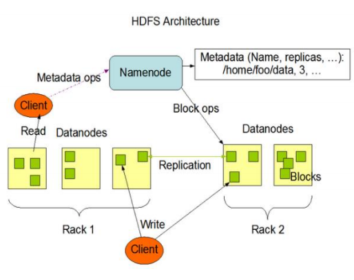
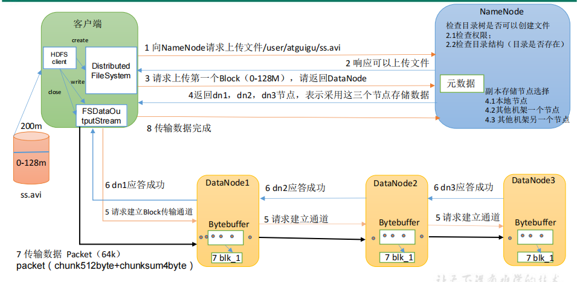
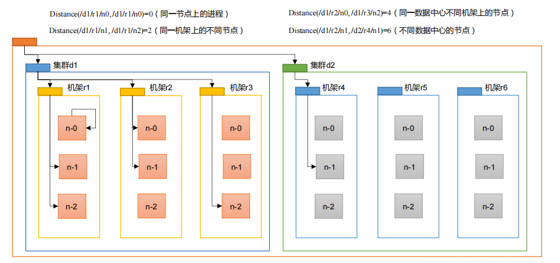
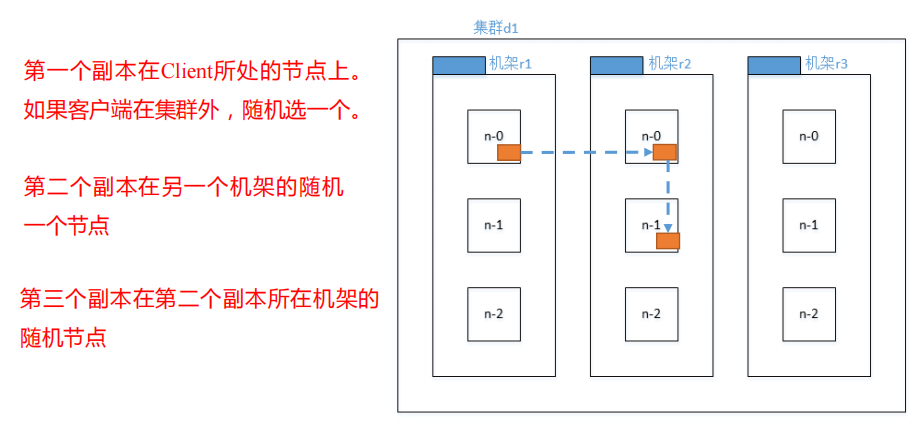
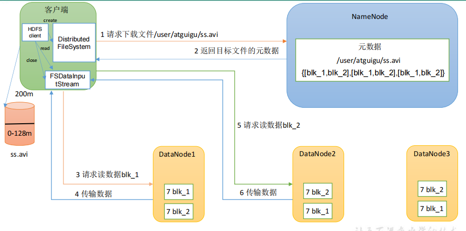

# HDFS

## 一、HDFS概述
### 1.1 HDFS 产出背景及定义
#### 1）HDFS 产生背景
随着数据量越来越大，在一个操作系统存不下所有的数据，那么就分配到更多的操作系统管理的磁盘中，但是不方便管理和维护，迫切需要一种系统来管理多台机器上的文件，这就是分布式文件管理系统。HDFS 只是分布式文件管理系统中的一种。
#### 2）HDFS 定义
HDFS（Hadoop Distributed File System），它是一个文件系统，用于存储文件，通过目录树来定位文件；其次，它是分布式的，由很多服务器联合起来实现其功能，集群中的服务器有各自的角色。
HDFS 的使用场景：适合一次写入，多次读出的场景。一个文件经过创建、写入和关闭之后就不需要改变。

### 1.2 HDFS 优缺点
#### 1）优点
① 高容错性   
➢ 数据自动保存多个副本。它通过增加副本的形式，提高容错性。   
➢ 某一个副本丢失以后，它可以自动恢复。   
② 适合处理大数据   
➢ 数据规模：能够处理数据规模达到GB、TB、甚至PB级别的数据；   
➢ 某一个副本丢失以后，它可以自动恢复。   
➢ 文件规模：能够处理百万规模以上的文件数量，数量相当之大。    
③ 可构建在廉价机器上，通过多副本机制，提高可靠性。
#### 2）缺点
① 不适合低延时数据访问，比如毫秒级的存储数据，是做不到的。   
② 无法高效的对大量小文件进行存储。    
➢ 存储大量小文件的话，它会占用NameNode大量的内存来存储文件目录和块信息。这样是不可取的，因为NameNode的内存总是有限的；   
➢ 小文件存储的寻址时间会超过读取时间，它违反了HDFS的设计目标。   
③ 不支持并发写入、文件随机修改。   
➢ 一个文件只能有一个写，不允许多个线程同时写；   
➢ 仅支持数据append（追加），不支持文件的随机修改。

### 1.3 HDFS 组成架构

#### 1）NameNode（nn）
就是Master，它是一个主管、管理者。   
（1）管理HDFS的名称空间；   
（2）配置副本策略；    
（3）管理数据块（Block）映射信息；    
（4）处理客户端读写请求。 
#### 2）DataNode
就是Slave。NameNode下达命令，DataNode执行实际的操作。    
（1）存储实际的数据块；   
（2）执行数据块的读/写操作。   
#### 3）Client：   
就是客户端。    
（1）文件切分。文件上传HDFS的时候，Client将文件切分成一个一个的Block，然后进行上传；    
（2）与NameNode交互，获取文件的位置信息；   
（3）与DataNode交互，读取或者写入数据；   
（4）Client提供一些命令来管理HDFS，比如NameNode格式化；    
（5）Client可以通过一些命令来访问HDFS，比如对HDFS增删查改操作； 
#### 4）Secondary NameNode
并非NameNode的热备。当NameNode挂掉的时候，它并不能马上替换NameNode并提供服务。
（1）辅助NameNode，分担其工作量，比如定期合并Fsimage和Edits，并推送给NameNode ；    
（2）在紧急情况下，可辅助恢复NameNode。

### 1.4 HDFS 文件块大小（面试重点）
HDFS中的文件在物理上是分块存储（Block），块的大小可以通过配置参数(dfs.blocksize）来规定，默认大小在Hadoop2.x/3.x版本中是128M，1.x版本中是64M。
1）集群中的block   
2）如果寻址时间约为10ms，即查找到目标block的时间为10ms。   
3）寻址时间为传输时间的1%时，则为最佳状态。（专家）   
因此，传输时间=10ms/0.01=1000ms=1s   
4）而目前磁盘的传输速率普遍为100MB/s。   
5）block大小=1s*100MB/s=100MB   
> 思考：为什么块的大小不能设置太小，也不能设置太大？ 
> （1）HDFS的块设置太小，会增加寻址时间，程序一直在找块的开始位置；
> （2）如果块设置的太大，从磁盘传输数据的时间会明显大于定位这个块开始位置所需的时间。导致程序在处理这块数据时，会非常慢。
> 总结：HDFS块的大小设置主要取决于磁盘传输速率。

## 二、HDFS的Shell操作（开发重点）
### 2.1 基本语法
`hadoop fs 具体命令` 或 `hdfs dfs 具体命令`   
两个是完全相同的。
### 2.2 命令大全
```shell
[atguigu@hadoop102 hadoop-3.1.3]$ bin/hadoop fs

[-appendToFile <localsrc> ... <dst>]
        [-cat [-ignoreCrc] <src> ...]
        [-chgrp [-R] GROUP PATH...]
        [-chmod [-R] <MODE[,MODE]... | OCTALMODE> PATH...]
        [-chown [-R] [OWNER][:[GROUP]] PATH...]
        [-copyFromLocal [-f] [-p] <localsrc> ... <dst>]
        [-copyToLocal [-p] [-ignoreCrc] [-crc] <src> ... <localdst>]
        [-count [-q] <path> ...]
        [-cp [-f] [-p] <src> ... <dst>]
        [-df [-h] [<path> ...]]
        [-du [-s] [-h] <path> ...]
        [-get [-p] [-ignoreCrc] [-crc] <src> ... <localdst>]
        [-getmerge [-nl] <src> <localdst>]
        [-help [cmd ...]]
        [-ls [-d] [-h] [-R] [<path> ...]]
        [-mkdir [-p] <path> ...]
        [-moveFromLocal <localsrc> ... <dst>]
        [-moveToLocal <src> <localdst>]
        [-mv <src> ... <dst>]
        [-put [-f] [-p] <localsrc> ... <dst>]
        [-rm [-f] [-r|-R] [-skipTrash] <src> ...]
        [-rmdir [--ignore-fail-on-non-empty] <dir> ...]
<acl_spec> <path>]]
        [-setrep [-R] [-w] <rep> <path> ...]
        [-stat [format] <path> ...]
        [-tail [-f] <file>]
        [-test -[defsz] <path>]
        [-text [-ignoreCrc] <src> ...]
```

### 2.3 常用命令讲解
#### 1）上传
`-moveFromLocal` - 从本地**剪切**粘贴到 HDFS：`hadoop fs -moveFromLocal <localsrc> ... <dst>`   
`-copyFromLocal` - 从本地文件系统中**拷贝**文件到 HDFS 路径去：`hadoop fs -copyFromLocal [-f] [-p] <localsrc> ... <dst>`   
`-put` - 等同于 `-copyFromLocal`，生产环境更习惯用`-put`：`hadoop fs -put [-f] [-p] <localsrc> ... <dst>`   
`-appendToFile` - 追加一个文件到已经存在的文件末尾：`hadoop fs -put [-f] [-p] <localsrc> ... <dst>`

#### 2）下载
`-copyToLocal` - 从 HDFS 拷贝到本地：`hadoop fs -copyToLocal [-p] [-ignoreCrc] [-crc] <src> ... <localdst>`   
`-get` - 等同于 `-copyToLocal`，生产环境更习惯用 `-get`：`hadoop fs -get [-p] [-ignoreCrc] [-crc] <src> ... <localdst>`   

#### 3）HDFS直接操作
`-ls` - 显示目录信息：`hadoop fs -ls [-d] [-h] [-R] [<path> ...]`   
`-cat` - 显示文件内容：`hadoop fs [-cat [-ignoreCrc] <src> ...`   
`-chgrp、-chmod、-chown` - Linux 文件系统中的用法一样，修改文件所属权限：
```shell
hadoop fs -chgrp [-R] GROUP PATH...
hadoop fs -chmod [-R] <MODE[,MODE]... | OCTALMODE> PATH...
hadoop fs -chown [-R] [OWNER][:[GROUP]] PATH...
```
`-mkdir` - 创建路径：`hadoop fs -mkdir [-p] <path> ...`   
`-cp` - 从 HDFS 的一个路径拷贝到 HDFS 的另一个路径：`hadoop fs -cp [-f] [-p] <src> ... <dst>`   
`-mv` - 在 HDFS 目录中移动文件：`hadoop fs -mv <src> ... <dst>`
`-tail` - 显示一个文件的末尾 1kb 的数据：`hadoop fs -tail [-f] <file>`
`-rm` - 删除文件或文件夹：`hadoop fs -rm [-f] [-r|-R] [-skipTrash] <src> ...`   
`-rm -r` - 递归删除目录及目录里面内容：`hadoop fs -rm [-f] [-r|-R] [-skipTrash] <src> ...`   
`-du` - 统计文件夹的大小信息：`hadoop fs -du [-s] [-h] <path> ...`   
`-setrep` - 设置 HDFS 中文件的副本数量：`hadoop fs -setrep [-R] [-w] <rep> <path> ...`
这里设置的副本数只是记录在 NameNode 的元数据中，是否真的会有这么多副本，还得看 DataNode 的数量。因为目前只有 3 台设备，最多也就 3 个副本，只有节点数的增加到 10 台时，副本数才能达到 10。

## 三、HDFS的API操作
### 3.1 配置环境
需要将 hadoop 的文件夹拷贝在不含中文的目录下   
配置环境变量 `HADOOP_HOME`，值为 hadoop 的目录，然后在 Path 中配置 `%HADOOP_HOME%\bin`   
双击 winutils.exe，若出现 “找不到 MSVCR120.dll” 错误，则需要安装 [微软运行库](img/MSVBCRT_AIO_2018.07.31_X86+X64.exe)
### 3.2 代码
见项目 [HDFSClient](/HDFSClient)


## 四、HDFS的读写流程（面试重点）
### 4.1 HDFS 写数据流程
#### 4.1.1 剖析文件写入
   
（1）客户端通过 Distributed FileSystem 模块向 NameNode 请求上传文件，NameNode 检查目标文件是否已存在，父目录是否存在。   
（2）NameNode 返回是否可以上传。   
（3）客户端请求第一个 Block 上传到哪几个 DataNode 服务器上。   
（4）NameNode 返回 3 个 DataNode 节点，分别为 dn1、dn2、dn3。 （5）客户端通过 FSDataOutputStream 模块请求 dn1 上传数据，dn1 收到请求会继续调用dn2，然后 dn2 调用 dn3，将这个通信管道建立完成。   
（6）dn1、dn2、dn3 逐级应答客户端。   
（7）客户端开始往 dn1 上传第一个 Block（先从磁盘读取数据放到一个本地内存缓存），以 Packet 为单位，dn1 收到一个 Packet 就会传给 dn2，dn2 传给 dn3；dn1 每传一个 packet 会放入一个应答队列等待应答。   
（8）当一个 Block 传输完成之后，客户端再次请求 NameNode 上传第二个 Block 的服务器。（重复执行 3-7 步）。
#### 4.1.2 网络拓扑-节点距离计算
在 HDFS 写数据的过程中，NameNode 会选择距离待上传数据最近距离的 DataNode 接收数据。那么这个最近距离怎么计算呢？
节点距离：两个节点到达最近的共同祖先的距离总和。   

#### 4.1.3 机架感知（副本存储节点选择）
##### 1）机架感知说明   
（1）官方说明   
[http://hadoop.apache.org/docs/r3.1.3/hadoop-project-dist/hadoop-hdfs/HdfsDesign.html#Data_Replication](http://hadoop.apache.org/docs/r3.1.3/hadoop-project-dist/hadoop-hdfs/HdfsDesign.html#Data_Replication)   
> For the common case, when the replication factor is three, HDFS’s placement policy is to put one replica on the local machine if the writer is on a datanode, otherwise on a random datanode, another replica on a node in a different (remote) rack, and the last on a different node in the same remote rack. This policy cuts the inter-rack write traffic which generally improves write performance. The chance of rack failure is far less than that of node failure; this policy does not impact data reliability and availability guarantees. However, it does reduce the aggregate network bandwidth used when reading data since a block is placed in only two unique racks rather than three. With this policy, the replicas of a file do not evenly distribute across the racks. One third of replicas are on one node, two thirds of replicas are on one rack, and the other third are evenly distributed across the remaining racks. This policy improves write performance without compromising data reliability or read performance.

（2）源码说明
Crtl + n 查找 BlockPlacementPolicyDefault，在该类中查找 chooseTargetInOrder 方法。 
##### 2）Hadoop3.1.3 副本节点选择


4.2 HDFS 读数据流程
   
（1）客户端通过 DistributedFileSystem 向 NameNode 请求下载文件，NameNode 通过查询元数据，找到文件块所在的 DataNode 地址。   
（2）挑选一台 DataNode（就近原则，然后随机）服务器，请求读取数据。    
（3）DataNode 开始传输数据给客户端（从磁盘里面读取数据输入流，以 Packet 为单位来做校验）。   
（4）客户端以 Packet 为单位接收，先在本地缓存，然后写入目标文件。
