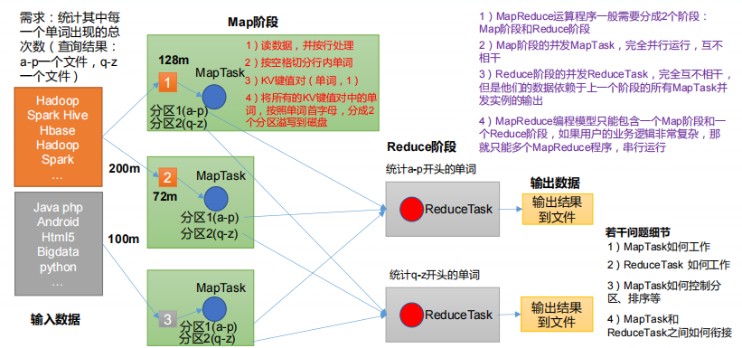

# Map Reduce

## 一、MapReduce概述
### 1.1 MapReduce 定义
MapReduce 是一个分布式运算程序的编程框架，是用户开发“基于 Hadoop 的数据分析应用”的核心框架。
MapReduce 核心功能是将用户编写的业务逻辑代码和自带默认组件整合成一个完整的分布式运算程序，并发运行在一个 Hadoop 集群上。
### 1.2 MapReduce 优缺点
#### 1.2.1 优点
1）MapReduce 易于编程   
它简单的实现一些接口，就可以完成一个分布式程序，这个分布式程序可以分布到大量廉价的 PC 机器上运行。也就是说你写一个分布式程序，跟写一个简单的串行程序是一模一样的。就是因为这个特点使得 MapReduce 编程变得非常流行。
2）良好的扩展性   
当你的计算资源不能得到满足的时候，你可以通过简单的增加机器来扩展它的计算能力。   
3）高容错性   
MapReduce 设计的初衷就是使程序能够部署在廉价的 PC 机器上，这就要求它具有很高的容错性。比如其中一台机器挂了，它可以把上面的计算任务转移到另外一个节点上运行，不至于这个任务运行失败，而且这个过程不需要人工参与，而完全是由 Hadoop 内部完成的。   
4）适合 PB 级以上海量数据的离线处理   
可以实现上千台服务器集群并发工作，提供数据处理能力。   
#### 1.2.2 缺点
1）不擅长实时计算   
MapReduce 无法像 MySQL 一样，在毫秒或者秒级内返回结果。   
2）不擅长流式计算   
流式计算的输入数据是动态的，而 MapReduce 的输入数据集是静态的，不能动态变化。   
这是因为 MapReduce 自身的设计特点决定了数据源必须是静态的。   
3）不擅长 DAG（有向无环图）计算   
多个应用程序存在依赖关系，后一个应用程序的输入为前一个的输出。在这种情况下，MapReduce 并不是不能做，而是使用后，每个 MapReduce 作业的输出结果都会写入到磁盘，会造成大量的磁盘 IO，导致性能非常的低下。   
### 1.3 MapReduce 核心思想
   
（1）分布式的运算程序往往需要分成至少 2 个阶段。   
（2）第一个阶段的 MapTask 并发实例，完全并行运行，互不相干。   
（3）第二个阶段的 ReduceTask 并发实例互不相干，但是他们的数据依赖于上一个阶段的所有 MapTask 并发实例的输出。   
（4）MapReduce 编程模型只能包含一个 Map 阶段和一个 Reduce 阶段，如果用户的业务逻辑非常复杂，那就只能多个 MapReduce 程序，串行运行。   
总结：分析 WordCount 数据流走向深入理解 MapReduce 核心思想。   
### 1.4 MapReduce 进程
一个完整的 MapReduce 程序在分布式运行时有三类实例进程：   
（1）MrAppMaster：负责整个程序的过程调度及状态协调。   
（2）MapTask：负责 Map 阶段的整个数据处理流程。   
（3）ReduceTask：负责 Reduce 阶段的整个数据处理流程。   
### 1.5 官方 WordCount 源码
采用反编译工具反编译源码，发现 WordCount 案例有 Map 类、Reduce 类和驱动类。且数据的类型是 Hadoop 自身封装的序列化类型。
### 1.6 常用数据序列化类型

| Java类型 | Hadoop Writable类型 |
| :---: | :---: |
| Boolean | BooleanWritable |
| Byte | ByteWritable |
| Int | IntWritable |
| Float | FloatWritable |
| Long | LongWritable |
| Double | DoubleWritable |
| String | Text |
| Map | MapWritable |
| Array | ArrayWritable |
| Null | NullWritable |

### 1.7 MapReduce 编程规范
用户编写的程序分成三个部分：Mapper、Reducer 和 Driver。
#### 1．Mapper阶段
（1）用户自定义的Mapper要继承自己的父类   
（2）Mapper的输入数据是KV对的形式（KV的类型可自定义）    
（3）Mapper中的业务逻辑写在map()方法中   
（4）Mapper的输出数据是KV对的形式（KV的类型可自定义）    
（5）map()方法（MapTask进程）对每一个<K,V>调用一次
#### 2．Reducer阶段
（1）用户自定义的Reducer要继承自己的父类   
（2）Reducer的输入数据类型对应Mapper的输出数据类型，也是KV   
（3）Reducer的业务逻辑写在reduce()方法中   
（4）ReduceTask进程对每一组相同k的<k,v>组调用一次reduce()方法   
#### 3．Driver阶段
相当于YARN集群的客户端，用于提交我们整个程序到YARN集群，提交的是封装了MapReduce程序相关运行参数的job对象
### 1.8 WordCount 案例实操
#### 1.8.1 本地测试
##### 1）需求：在给定的文本文件中统计输出每一个单词出现的总次数
（1）输入数据（以文件的形式输入）
```text
atguigu atguigu
ss ss
cls cls
jiao
banzhang
xue
hadoop
```
（2）期望输出数据
```text
atguigu 2
banzhang 1
cls 2
hadoop 1
jiao 1
ss 2
xue 1
```
##### 2）需求分析
按照 MapReduce 编程规范，分别编写 Mapper，Reducer，Driver。
##### 3）环境准备
需要把正确的 hadoop.dll 拷贝到 C:\Windows\System32 目录下   
##### 4）代码
[MapReduceDemo](/MapReduceDemo)
##### 5）生成结果
生成的文件及其对应的含义：

| 文件名 | 文件含义 |
| :---: | :---: |
| ._SUCCESS.crc | 校验码 |
| .part-r-00000.crc | 校验码 |
| _SUCCESS | 用来表示执行成功 |
| part-r-00000 | 表示第一块分区的数据 |


## 二、Hadoop 序列化
### 2.1 序列化概述
#### 1）什么是序列化
序列化就是把内存中的对象，转换成字节序列（或其他数据传输协议）以便于存储到磁盘（持久化）和网络传输。   
反序列化就是将收到字节序列（或其他数据传输协议）或者是磁盘的持久化数据，转换成内存中的对象。
#### 2）为什么要序列化
一般来说，“活的”对象只生存在内存里，关机断电就没有了。而且“活的”对象只能由本地的进程使用，不能被发送到网络上的另外一台计算机。 然而序列化可以存储“活的”对象，可以将“活的”对象发送到远程计算机。
#### 3）为什么不用 Java 的序列化
Java 的序列化是一个重量级序列化框架（Serializable），一个对象被序列化后，会附带很多额外的信息（各种校验信息，Header，继承体系等），不便于在网络中高效传输。所以，Hadoop 自己开发了一套序列化机制（Writable）。
#### 4）Hadoop 序列化特点：
（1）紧凑 ：高效使用存储空间。   
（2）快速：读写数据的额外开销小。   
（3）互操作：支持多语言的交互   
### 2.2 自定义 bean 对象实现序列化接口（Writable） 
在企业开发中往往常用的基本序列化类型不能满足所有需求，比如在 Hadoop 框架内部传递一个 bean 对象，那么该对象就需要实现序列化接口。   
具体实现 bean 对象序列化步骤如下 7 步。    
（1）必须实现 Writable 接口   
（2）反序列化时，需要反射调用空参构造函数，所以必须有空参构造   
```java
public FlowBean() {
    super();
}
```
（3）重写序列化方法   
```java
@Override
public void write(DataOutput out) throws IOException {
    out.writeLong(upFlow);
    out.writeLong(downFlow);
    out.writeLong(sumFlow);
}
```
（4）重写反序列化方法
```java
@Override
public void readFields(DataInput in) throws IOException {
    upFlow = in.readLong();
    downFlow = in.readLong();
    sumFlow = in.readLong();
}
```
（5）注意反序列化的顺序和序列化的顺序完全一致   
（6）要想把结果显示在文件中，需要重写 toString()，可用"\t"分开，方便后续用。   
（7）如果需要将自定义的 bean 放在 key 中传输，则还需要实现 Comparable 接口，因为MapReduce 框中的 Shuffle 过程要求对 key 必须能排序。详见后面排序案例。   
```java
@Override
public int compareTo(FlowBean o) {
    // 倒序排列，从大到小
    return this.sumFlow > o.getSumFlow() ? -1 : 1;
}
```
### 2.3 序列化案例实操
#### 1）需求
统计每一个手机号耗费的总上行流量、总下行流量、总流量   
（1）数据
```text
1	13736230513	192.196.100.1	www.atguigu.com	2481	24681	200
2	13846544121	192.196.100.2			264	0	200
3 	13956435636	192.196.100.3			132	1512	200
4 	13966251146	192.168.100.1			240	0	404
5 	18271575951	192.168.100.2	www.atguigu.com	1527	2106	200
6 	84188413	192.168.100.3	www.atguigu.com	4116	1432	200
7 	13590439668	192.168.100.4			1116	954	200
8 	15910133277	192.168.100.5	www.hao123.com	3156	2936	200
9 	13729199489	192.168.100.6			240	0	200
10 	13630577991	192.168.100.7	www.shouhu.com	6960	690	200
11 	15043685818	192.168.100.8	www.baidu.com	3659	3538	200
12 	15959002129	192.168.100.9	www.atguigu.com	1938	180	500
13 	13560439638	192.168.100.10			918	4938	200
14 	13470253144	192.168.100.11			180	180	200
15 	13682846555	192.168.100.12	www.qq.com	1938	2910	200
16 	13992314666	192.168.100.13	www.gaga.com	3008	3720	200
17 	13509468723	192.168.100.14	www.qinghua.com	7335	110349	404
18 	18390173782	192.168.100.15	www.sogou.com	9531	2412	200
19 	13975057813	192.168.100.16	www.baidu.com	11058	48243	200
20 	13768778790	192.168.100.17			120	120	200
21 	13568436656	192.168.100.18	www.alibaba.com	2481	24681	200
22 	13568436656	192.168.100.19			1116	954	200
```
（2）格式
```text
1	13736230513	192.196.100.1	www.atguigu.com	2481	24681	200
id  手机号码      网络IP          域名             上行流量 下行流量  网络状态码
```
#### 2）实操
[代码（writable）](/MapReduceDemo)
