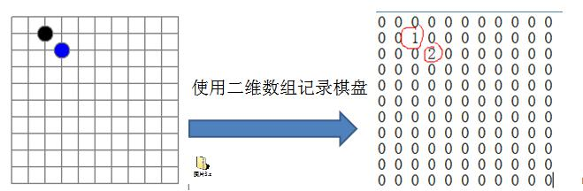
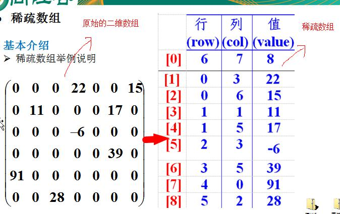

# 一、稀疏数组（SparseArray）
## 1.1 实际需求
   
> 问题：
> 该二维数组很多值都是默认值0，记录了很多没有意义的数据
> 
> 解决：
> 1）记录数组一共有几行几列，有多少个不同的值
> 2）把具有不同值的元素的行列及值记录在一个小规模的数组中，从而缩小程序的规模
> 

   
[稀疏数组示例代码](../src/_01稀疏数组和队列/_01稀疏数组/SparseArray.java)

# 二、队列
## 2.1 队列介绍
1) 队列是一个有序列表，可以用数组或是链表来实现。   
2) 遵循先入先出的原则（FIFO，first in first out）。（即：先存入队列的数据，要先取出。后存入的要后取出）   

[数组模拟队列](../src/_01稀疏数组和队列/_02队列/ArrayQueueDemo.java)   

## 2.2 环形队列
> 问题：
> 设一个队列长度为10，先向队列中添加10个元素，再弹出5个，此时若使用上述队列会抛出队列已满异常
> 
> 解决：
> 1）尾索引的**下一个**为头索引时表示队列满，即 (rear + 1) % maxSize == front
> 2）rear == front 为空
> 

解释：   
(rear + 1) % maxSize是 rear 指针的下一位，循环队列中，头指针和尾指针重合是空状态，尾指针的下一位是头指针是满状态

[循环队列](../src/_01稀疏数组和队列/_02队列/CircleArrayQueueDemo.java)
