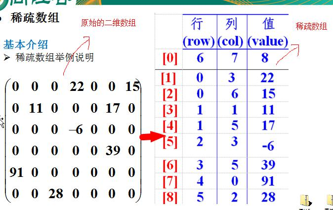

# 一、稀疏数组（SparseArray）
## 1.1 实际需求
   
> 问题：
> 该二维数组很多值都是默认值0，记录了很多没有意义的数据
> 
> 解决：
> 1）记录数组一共有几行几列，有多少个不同的值
> 2）把具有不同值的元素的行列及值记录在一个小规模的数组中，从而缩小程序的规模
> 

   
[稀疏数组示例代码](/src/_01稀疏数组和队列/_01稀疏数组/SparseArray.java)

