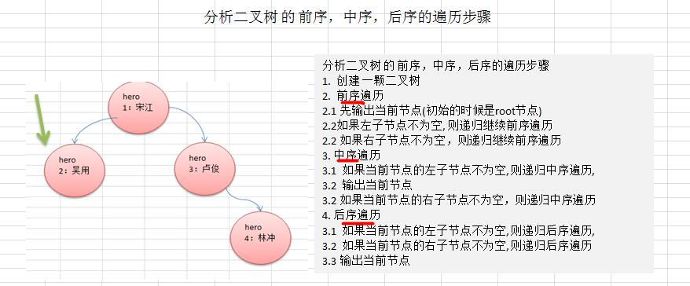
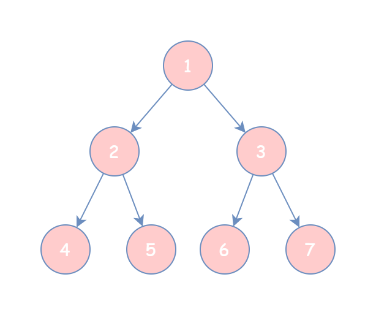
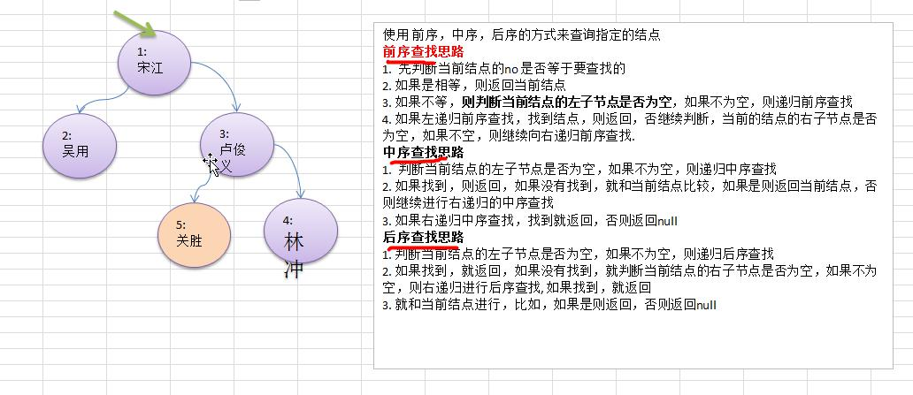
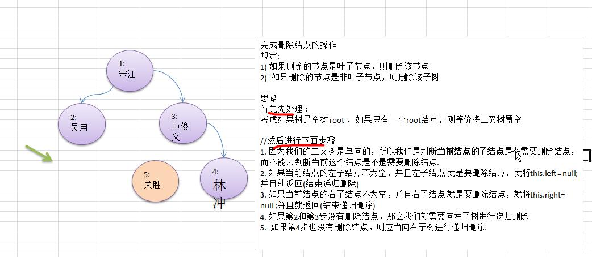
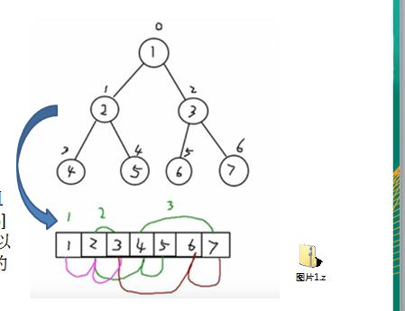
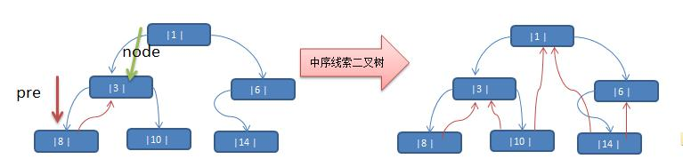

# 树

## 1.1 二叉树
### 1.1.1 为什么需要树这种数据结构
1) 数组存储方式的分析   
优点：通过下标方式访问元素，速度快。对于有序数组，还可使用二分查找提高检索速度。    
缺点：如果要检索具体某个值，或者插入值(按一定顺序)会整体移动，效率较低
2) 链式存储方式的分析    
优点：在一定程度上对数组存储方式有优化(比如：插入一个数值节点，只需要将插入节点，链接到链表中即可，删除效率也很好)。    
缺点：在进行检索时，效率仍然较低，比如(检索某个值，需要从头节点开始遍历)
3) 树存储方式的分析能提高数据存储，读取的效率，比如利用二叉排序树(Binary Sort Tree)，既可以保证数据的检索速度，同时也可以保证数据的插入，删除，修改的速度。

### 1.1.2 树示意图

### 1.1.3 树的常用概念
1) 树有很多种，每个节点最多只能有两个子节点的一种形式称为二叉树。 
2) 二叉树的子节点分为左节点和右节点 
3) 示意图   
   
4) 如果该二叉树的所有叶子节点都在最后一层，并且结点总数= 2^n -1 , n 为层数，则我们称为满二叉树。   
   
5) 如果该二叉树的所有叶子节点都在最后一层或者倒数第二层，而且最后一层的叶子节点在左边连续，倒数第二 层的叶子节点在右边连续，我们称为完全二叉树   

### 1.1.4 二叉树遍历的说明
使用前序，中序和后序对下面的二叉树进行遍历
1) 前序遍历: 先输出父节点，再遍历左子树和右子树 
2) 中序遍历: 先遍历左子树，再输出父节点，再遍历右子树
3) 后序遍历: 先遍历左子树，再遍历右子树，最后输出父节点 
4) 小结: 看输出父节点的顺序，就确定是前序，中序还是后序

### 1.1.5 二叉树遍历应用实例（前序、中序、后序）
   
[前序、中序、后序查找示例代码 testOrder()](../src/_08树结构基础/_01二叉树遍历/BinaryTreeDemo.java)      
   
对于如上二叉树：   
1) 先序遍历(根节点 -> 左孩子 -> 右孩子)：1 2 4 5 3 6 7
2) 中序遍历(左孩子 -> 根节点 -> 右孩子)：4 2 5 1 6 3 7
3) 后序遍历(左孩子 -> 右孩子 -> 根节点)：4 5 2 6 7 3 1

### 1.1.6 二叉树查找指定结点

[前序、中序、后序查找示例代码 testSearch()](../src/_08树结构基础/_01二叉树遍历/BinaryTreeDemo.java)   

### 1.1.7 二叉树删除结点（一）
需求：   
1) 如果删除的节点是叶子节点，则删除该节点    
2) 如果删除的节点是非叶子节点，则删除该子树   
      
3) 无法删除根节点   
[前序、中序、后序查找示例代码 testRemove()](../src/_08树结构基础/_01二叉树遍历/BinaryTreeDemo.java)   

### 1.1.8 二叉树删除结点（二）
1) 如果要删除的节点是非叶子节点，现在我们不希望将该非叶子节点为根节点的子树删除
2) 如果该非叶子节点 A 只有一个子节点 B，则子节点 B 替代节点 A 
3) 如果该非叶子节点 A 有左子节点 B 和右子节点 C，则让左子节点 B 替代节点 A。 
4) 请大家思考，如何完成该删除功能, 老师给出提示.   
[前序、中序、后序查找示例代码 testRemove2()](../src/_08树结构基础/_01二叉树遍历/BinaryTreeDemo.java)   

## 1.2 顺序存储二叉树
### 1.2.1  顺序存储二叉树
从数据存储来看，数组存储方式和树的存储方式可以相互转换，即数组可以转换成树，树也可以转换成数组。   

顺序存储二叉树的特点:    
1) 顺序二叉树通常只考虑完全二叉树 
2) 第 n 个元素的左子节点为 2 * n + 1 
3) 第 n 个元素的右子节点为 2 * n + 2 
4) 第 n 个元素的父节点为 (n-1) / 2 
5) n : 表示二叉树中的第几个元素(按 0 开始编号如图所示)   

[顺序存储二叉树示例代码](../src/_08树结构基础/_02顺序存储二叉树/ArrayBinaryTreeDemo.java)

## 1.3 线索化二叉树
### 1.3.1 需求
将 `{1, 3, 6, 8, 10, 14}` 构建成一颗二叉树，n+1=7   
   
分析：6, 8, 10, 14 这几个节点的左右指针，并没有完全的利用上

### 1.3.2 线索二叉树基本介绍
1) n 个结点的二叉链表中含有 n+1 【公式 2n-(n-1)=n+1】 个空指针域。利用二叉链表中的空指针域，存放指向 该结点在某种遍历次序下的前驱和后继结点的指针（这种附加的指针称为"线索"） 
2) 这种加上了线索的二叉链表称为线索链表，相应的二叉树称为线索二叉树(Threaded BinaryTree)。根据线索性质 的不同，线索二叉树可分为前序线索二叉树、中序线索二叉树和后序线索二叉树三种 
3) 一个结点的前一个结点，称为前驱结点 
4) 一个结点的后一个结点，称为后继结点

### 1.3.3 线索化二叉树应用案例（emmm....无法理解）
应用案例说明：将下面的二叉树，进行中序线索二叉树。中序遍历的数列为 {8, 3, 10, 1, 14, 6}   
   
思路分析: 中序遍历的结果：{8, 3, 10, 1, 14, 6}   
    
说明: 当线索化二叉树后，Node 节点的 属性 left 和 right ，有如下情况:    
1) left 指向的是左子树，也可能是指向的前驱节点. 比如 ① 节点 left 指向的左子树, 而 ⑩ 节点的 left 指向的就是前驱节点.    
2) right 指向的是右子树，也可能是指向后继节点，比如 ① 节点 right 指向的是右子树，而 ⑩ 节点的 right 指向的是后继节点   

[中序线索化二叉树示例代码](../src/_08树结构基础/0)
