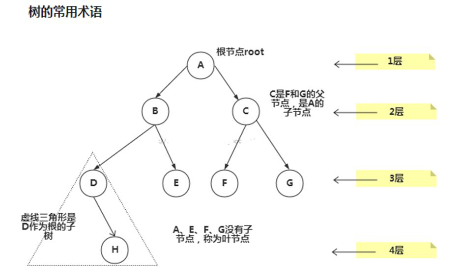
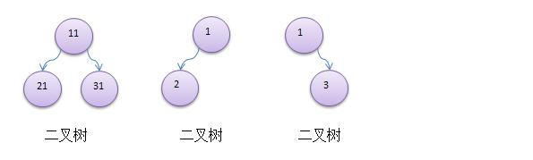
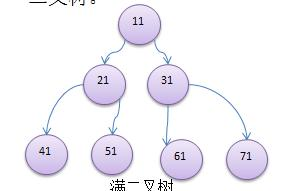
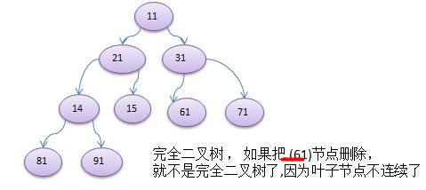

# 树

## 1.1 二叉树
### 1.1.1 为什么需要树这种数据结构
1) 数组存储方式的分析   
优点：通过下标方式访问元素，速度快。对于有序数组，还可使用二分查找提高检索速度。    
缺点：如果要检索具体某个值，或者插入值(按一定顺序)会整体移动，效率较低
2) 链式存储方式的分析    
优点：在一定程度上对数组存储方式有优化(比如：插入一个数值节点，只需要将插入节点，链接到链表中即可，删除效率也很好)。    
缺点：在进行检索时，效率仍然较低，比如(检索某个值，需要从头节点开始遍历)
3) 树存储方式的分析能提高数据存储，读取的效率，比如利用二叉排序树(Binary Sort Tree)，既可以保证数据的检索速度，同时也可以保证数据的插入，删除，修改的速度。

### 1.1.2 树示意图

### 1.1.3 树的常用概念
1) 树有很多种，每个节点最多只能有两个子节点的一种形式称为二叉树。 
2) 二叉树的子节点分为左节点和右节点 
3) 示意图

4) 如果该二叉树的所有叶子节点都在最后一层，并且结点总数= 2^n -1 , n 为层数，则我们称为满二叉树。

5) 如果该二叉树的所有叶子节点都在最后一层或者倒数第二层，而且最后一层的叶子节点在左边连续，倒数第二 层的叶子节点在右边连续，我们称为完全二叉树

