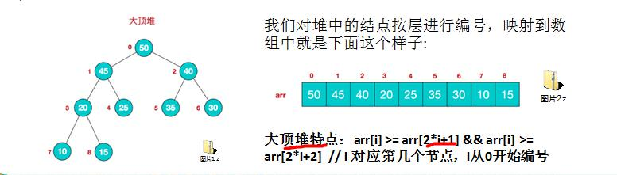
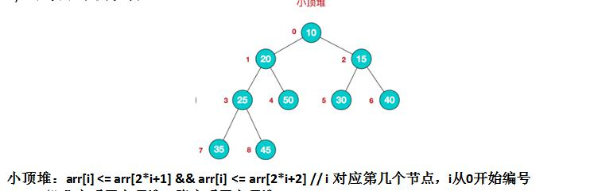
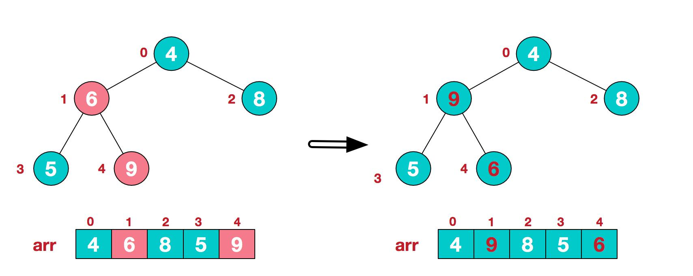
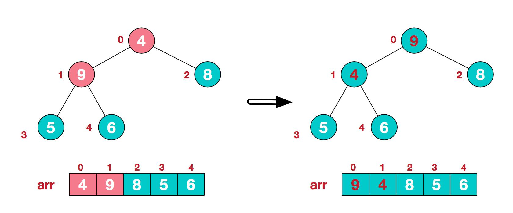
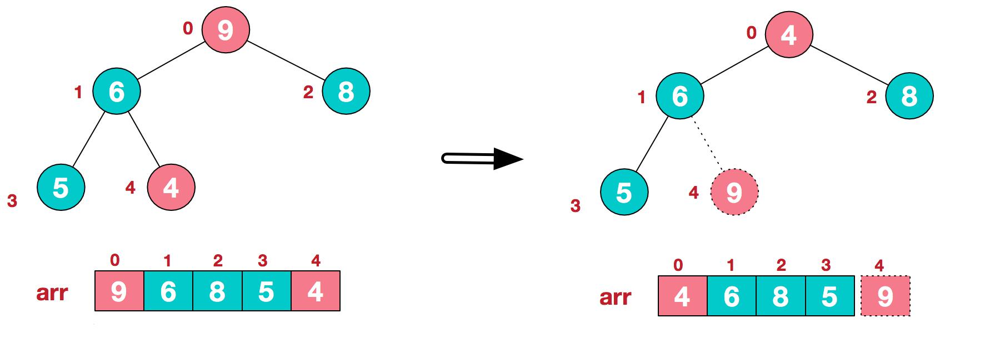
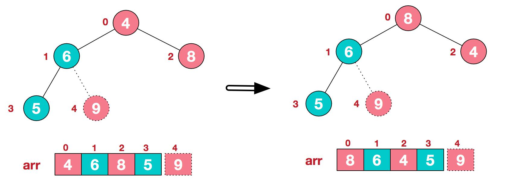
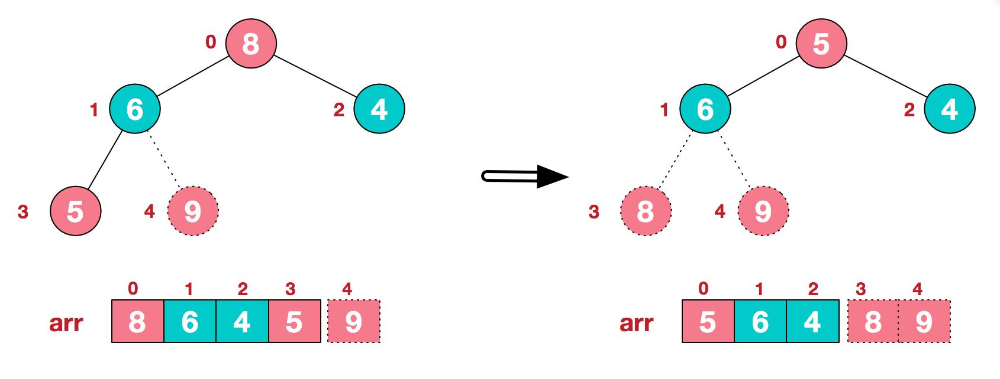
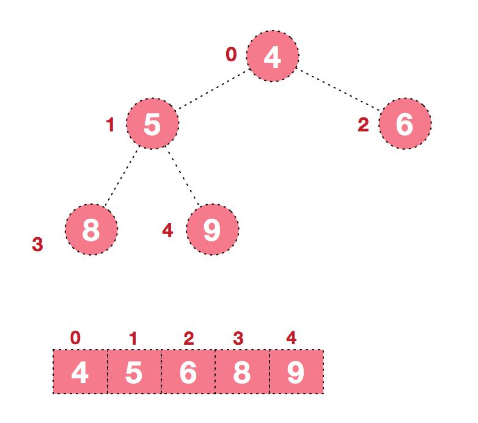

# 树结构实际应用

## 1.1 堆排序
### 1.1.1 堆排序基本介绍
1) 堆排序是利用堆这种数据结构而设计的一种排序算法，堆排序是一种选择排序，它的最坏，最好，平均时间复 杂度均为 O(nlogn)，它也是不稳定排序。 
2) 堆是具有以下性质的完全二叉树：每个结点的值都大于或等于其左右孩子结点的值，称为大顶堆, 注意 : 没有 要求结点的左孩子的值和右孩子的值的大小关系。   

3) 每个结点的值都小于或等于其左右孩子结点的值，称为小顶堆    
   
4) 一般升序采用大顶堆，降序采用小顶堆

### 1.1.2 堆排序基本思想 
1) 将待排序序列构造成一个大顶堆 
2) 此时，整个序列的最大值就是堆顶的根节点。 
3) 将其与末尾元素进行交换，此时末尾就为最大值。 
4) 然后将剩余 n-1 个元素重新构造成一个堆，这样会得到 n 个元素的次小值。如此反复执行，便能得到一个有序序列了。
5) 可以看到在构建大顶堆的过程中，元素的个数逐渐减少，最后就得到一个有序序列了.

### 1.1.3 堆排序
#### 步骤一 构造初始堆。将给定无序序列构造成一个大顶堆（一般升序采用大顶堆，降序采用小顶堆)。   
原始的数组 [4, 6, 8, 5, 9]

1) 假设给定无序序列结构如下   
   
2) 此时我们从最后一个非叶子结点开始（叶结点自然不用调整，第一个非叶子结点 arr.length/2-1=5/2-1=1，也就是下面的 6 结点），从左至右，从下至上进行调整。   
   
3) 找到第二个非叶节点 4，由于[4, 9, 8]中 9 元素最大，4 和 9 交换。      
   
4) 这时，交换导致了子根[4,5,6]结构混乱，继续调整，[4,5,6]中 6 最大，交换 4 和 6。   
   
此时，我们就将一个无序序列构造成了一个大顶堆。   

#### 步骤二 将堆顶元素与末尾元素进行交换，使末尾元素最大。然后继续调整堆，再将堆顶元素与末尾元素交换，得到第二大元素。如此反复进行交换、重建、交换。
1) 将堆顶元素 9 和末尾元素 4 进行交换   
   
2) 重新调整结构，使其继续满足堆定义   
    
3) 再将堆顶元素 8 与末尾元素 5 进行交换，得到第二大元素 8.   
   
4) 后续过程，继续进行调整，交换，如此反复进行，最终使得整个序列有序   
   

#### 总结
1) 将无序序列构建成一个堆，根据升序降序需求选择大顶堆或小顶堆; 
2) 将堆顶元素与末尾元素交换，将最大元素"沉"到数组末端; 
3) 重新调整结构，使其满足堆定义，然后继续交换堆顶元素与当前末尾元素，反复执行调整+交换步骤， 直到整个序列有序。

### 1.1.4 代码实现堆排序
补充：   
1) 对于完全二叉树来说，已知结点在数组中的坐标为 index，则其父节点为 (index - 1) / 2 ，两个子节点为 2 * index + 1 和 2 * index + 2

[堆排序示例代码](../src/_09树结构实际应用/_01堆排序/HeapSort.java)
